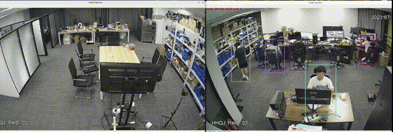

## 写在前面
- **主要在飞桨的跨镜头跟踪基础上进行改进,主要实现两路rtsp视频流的实时跨镜头跟踪,相较于原来只能跟踪视频数据的工程,主要改动在于```pipline.py```与```mtmct.py```**

### 简单介绍
- **相较于视频的mtmct,本质上是对两个视频的人物ID进行重新分配，无需真正的考虑跨境头的问题，不会出现一个人从一个镜头走到另一个，即一个人同时只出现在一个镜头的情况。视频推流的实时跟踪主要的难点在于各个人物的特征数据少,若是同一人出现在两镜头区域还好说,如果是从一个镜头走到另一个镜头,对于实时跟踪就要求存储两镜头中所有出现过的人物,进行对比,这样就会有很大的计算量.不过好歹最终效果有点像样,不管了**

### 底层苦劳工的心血展示



### 关于模型
- **模型都是用的最轻量级,原计划部署在npu,因为reid对数据精度要求颇高选择放弃**
## 🗳 模型库

### PP-Human

<details>
<summary><b>端到端模型效果（点击展开）</b></summary>

|         任务         |  端到端速度（ms）  |                                                                                                                                         模型方案                                                                                                                                         |                             模型体积                              |
| :------------------: | :----------------: | :--------------------------------------------------------------------------------------------------------------------------------------------------------------------------------------------------------------------------------------------------------------------------------------: | :---------------------------------------------------------------: |
|  行人检测（高精度）  |       25.1ms       |                                                                                             [多目标跟踪](https://bj.bcebos.com/v1/paddledet/models/pipeline/mot_ppyoloe_l_36e_pipeline.zip)                                                                                              |                               182M                                |
|  行人检测（轻量级）  |       16.2ms       |                                                                                             [多目标跟踪](https://bj.bcebos.com/v1/paddledet/models/pipeline/mot_ppyoloe_s_36e_pipeline.zip)                                                                                              |                                27M                                |
| 行人检测（超轻量级） |  10ms(Jetson AGX)  |                                                                                [多目标跟踪](https://bj.bcebos.com/v1/paddledet/models/pipeline/pphuman/ppyoloe_plus_crn_t_auxhead_320_60e_pphuman.tar.gz)                                                                                |                                17M                                |
|  行人跟踪（高精度）  |       31.8ms       |                                                                                             [多目标跟踪](https://bj.bcebos.com/v1/paddledet/models/pipeline/mot_ppyoloe_l_36e_pipeline.zip)                                                                                              |                               182M                                |
|  行人跟踪（轻量级）  |       21.0ms       |                                                                                             [多目标跟踪](https://bj.bcebos.com/v1/paddledet/models/pipeline/mot_ppyoloe_s_36e_pipeline.zip)                                                                                              |                                27M                                |
| 行人跟踪（超轻量级） | 13.2ms(Jetson AGX) |                                                                                [多目标跟踪](https://bj.bcebos.com/v1/paddledet/models/pipeline/pphuman/ppyoloe_plus_crn_t_auxhead_320_60e_pphuman.tar.gz)                                                                                |                                17M                                |
|    跨镜跟踪(REID)    |     单人1.5ms      |                                                                                                        [REID](https://bj.bcebos.com/v1/paddledet/models/pipeline/reid_model.zip)                                                                                                         |                             REID：92M                             |
|  属性识别（高精度）  |     单人8.5ms      |                                            [目标检测](https://bj.bcebos.com/v1/paddledet/models/pipeline/mot_ppyoloe_l_36e_pipeline.zip)<br> [属性识别](https://bj.bcebos.com/v1/paddledet/models/pipeline/strongbaseline_r50_30e_pa100k.zip)                                            |                  目标检测：182M<br>属性识别：86M                  |
|  属性识别（轻量级）  |     单人7.1ms      |                                            [目标检测](https://bj.bcebos.com/v1/paddledet/models/pipeline/mot_ppyoloe_l_36e_pipeline.zip)<br> [属性识别](https://bj.bcebos.com/v1/paddledet/models/pipeline/strongbaseline_r50_30e_pa100k.zip)                                            |                  目标检测：182M<br>属性识别：86M                  |
|       摔倒识别       |      单人10ms      | [多目标跟踪](https://bj.bcebos.com/v1/paddledet/models/pipeline/mot_ppyoloe_l_36e_pipeline.zip) <br> [关键点检测](https://bj.bcebos.com/v1/paddledet/models/pipeline/dark_hrnet_w32_256x192.zip) <br> [基于关键点行为识别](https://bj.bcebos.com/v1/paddledet/models/pipeline/STGCN.zip) | 多目标跟踪：182M<br>关键点检测：101M<br>基于关键点行为识别：21.8M |
|       闯入识别       |       31.8ms       |                                                                                             [多目标跟踪](https://bj.bcebos.com/v1/paddledet/models/pipeline/mot_ppyoloe_l_36e_pipeline.zip)                                                                                              |                               182M                                |
|       打架识别       |       19.7ms       |                                                                                              [视频分类](https://bj.bcebos.com/v1/paddledet/models/pipeline/mot_ppyoloe_l_36e_pipeline.zip)                                                                                               |                                90M                                |
|       抽烟识别       |     单人15.1ms     |                                    [目标检测](https://bj.bcebos.com/v1/paddledet/models/pipeline/mot_ppyoloe_l_36e_pipeline.zip)<br>[基于人体id的目标检测](https://bj.bcebos.com/v1/paddledet/models/pipeline/ppyoloe_crn_s_80e_smoking_visdrone.zip)                                    |            目标检测：182M<br>基于人体id的目标检测：27M            |
|      打电话识别      |       单人ms       |                                      [目标检测](https://bj.bcebos.com/v1/paddledet/models/pipeline/mot_ppyoloe_l_36e_pipeline.zip)<br>[基于人体id的图像分类](https://bj.bcebos.com/v1/paddledet/models/pipeline/PPHGNet_tiny_calling_halfbody.zip)                                       |            目标检测：182M<br>基于人体id的图像分类：45M            |


点击模型方案中的模型即可下载指定模型，下载后解压存放至`./output_inference`目录中

</details>


## 📚 详细文档

### 🚶‍♀️ 行人分析工具PP-Human

#### [快速开始](docs/tutorials/PPHuman_QUICK_STARTED.md)

#### 行为识别

- [快速开始](docs/tutorials/pphuman_action.md)

- [二次开发教程](../../docs/advanced_tutorials/customization/action_recognotion/README.md)

#### 行人属性/特征识别

- [快速开始](docs/tutorials/pphuman_attribute.md)

- [二次开发教程](../../docs/advanced_tutorials/customization/pphuman_attribute.md)

#### 跨镜跟踪/ReID

- [快速开始](docs/tutorials/pphuman_mtmct.md)

- [二次开发教程](../../docs/advanced_tutorials/customization/pphuman_mtmct.md)

#### 行人跟踪、人流计数与轨迹记录

- [快速开始](docs/tutorials/pphuman_mot.md)

- [二次开发教程](../../docs/advanced_tutorials/customization/pphuman_mot.md)

### 🚘 车辆分析工具PP-Vehicle

#### [快速开始](docs/tutorials/PPVehicle_QUICK_STARTED.md)

#### 车牌识别

- [快速开始](docs/tutorials/ppvehicle_plate.md)

- [二次开发教程](../../docs/advanced_tutorials/customization/ppvehicle_plate.md)

#### 车辆属性分析

- [快速开始](docs/tutorials/ppvehicle_attribute.md)

- [二次开发教程](../../docs/advanced_tutorials/customization/ppvehicle_attribute.md)

#### 违章检测

- [快速开始](docs/tutorials/ppvehicle_illegal_parking.md)

- [二次开发教程](../../docs/advanced_tutorials/customization/pphuman_mot.md)

#### 车辆跟踪、车流计数与轨迹记录

- [快速开始](docs/tutorials/ppvehicle_mot.md)

- [二次开发教程](../../docs/advanced_tutorials/customization/pphuman_mot.md)

#### 车辆违法压线

- [快速开始](docs/tutorials/ppvehicle_press.md)

- [二次开发教程](../../docs/advanced_tutorials/customization/ppvehicle_violation.md)

#### 车辆逆行

- [快速开始](docs/tutorials/ppvehicle_retrograde.md)

- [二次开发教程](../../docs/advanced_tutorials/customization/ppvehicle_violation.md)
